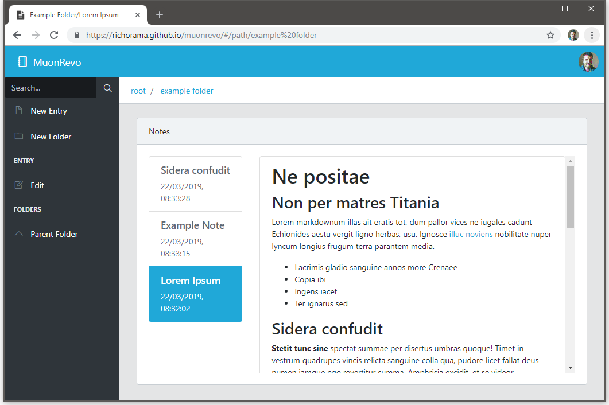

# MuonRevo

Markdown based note taking software, backed by dropbox.

## How it works

The app is based entirely in the browser, and can be served from any static web host (although you'll have to set up your own dropbox app if you want to host it on your own domain).

When you first visit the site you will be asked to authenticate with dropbox. 

This will then create a folder under 'Apps' in your dropbox account.

The editor will then use this to store all the entries you write.

Try is here https://richorama.github.io/muonrevo/

## License

MIT
